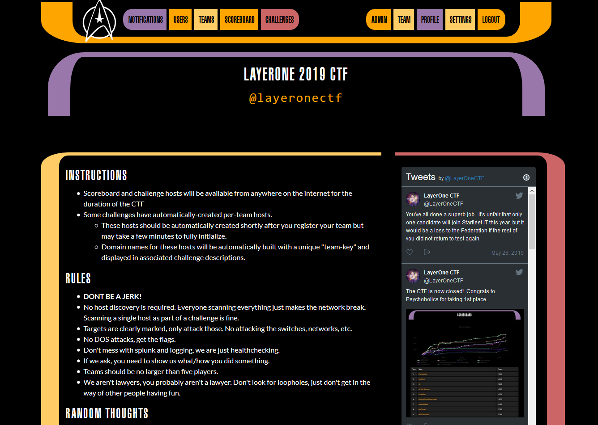
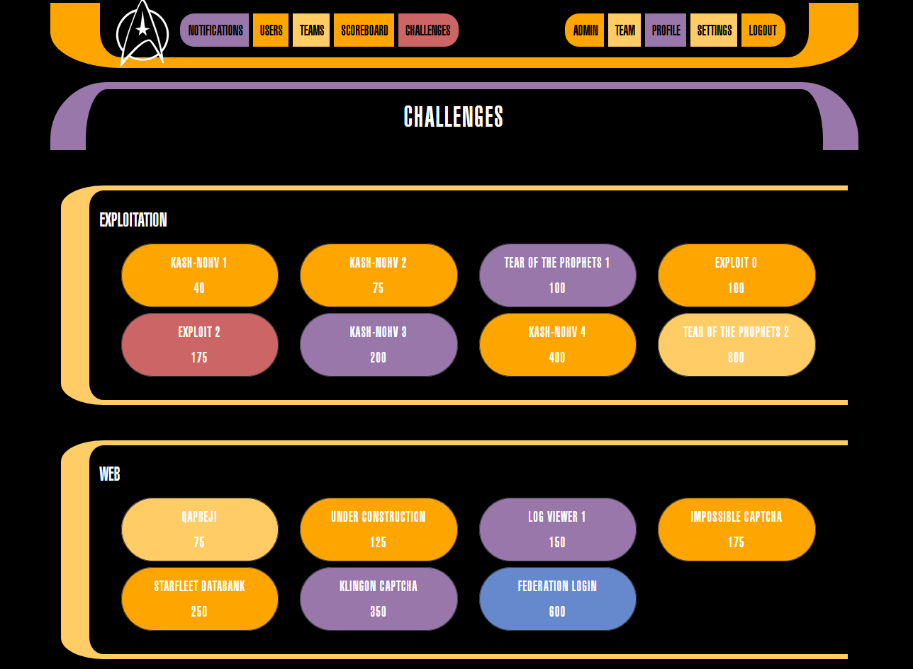
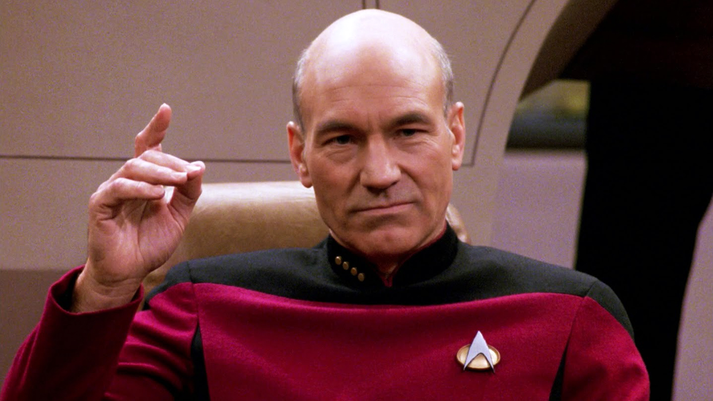

CTFd TrekTheme
==============

Star Trek [LCARS](https://en.wikipedia.org/wiki/LCARS) inspired pure CSS theme for
[CTFd](https://github.com/CTFd/CTFd) (v2.1.1) used during the 2019 
[LayerOne](https://www.layerone.org/) [CTF](https://twitter.com/layeronectf).

Instructions
------------
* Change into Starfleet uniform
* Host `lcars.woff` file on an http(s) server, ensuring served with correct `Content-Type: application/font-woff` mime header and [CORS-Allow headers](https://developer.mozilla.org/en-US/docs/Web/HTTP/Headers/Access-Control-Allow-Origin) if necesssary
* Modify woff url in top of `user.css` to point to to hosted file
* Navigate to `Admin > Config > Appearance` in CTFd, upload `starfleet.png` file as CTFd logo, paste contents of `user.css` into "Stylesheet editor" and update
* Customize content of `index.html` and paste into `Admin > Pages > All Pages > index` and save (if desired)
* *"Tea, Earl Grey, Hot"*
* Engage CTF

